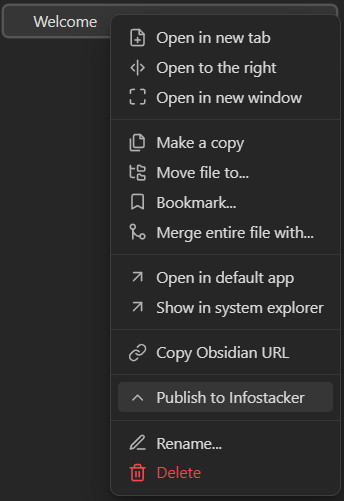
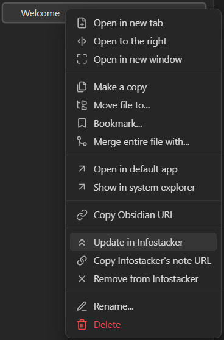
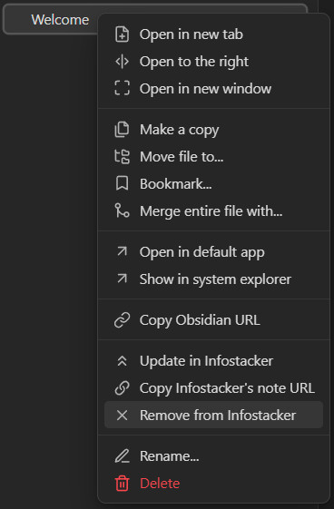
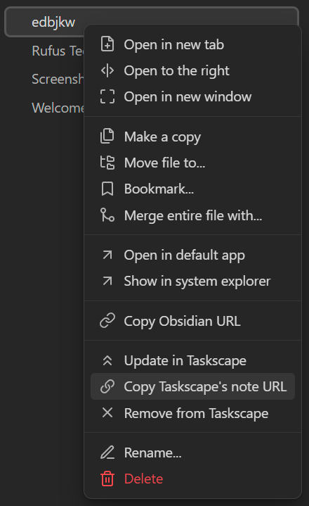

# Infostacker Note Publish Plugin Documentation

## Overview

The Infostacker Note Publish plugin enables users to send notes to a server, edit them, and delete them directly within the Obsidian program. Additionally, it allows users to share notes with others via a generated link. The plugin supports attachments, and users with the link can view the note along with its attachments in HTML format. The data is stored on our server for free, including storing files like pdfs, images etc. There is a daily limit of 100 published notes.

## Installation

### Prerequisites

- [Obsidian](https://obsidian.md/) installed on your system.
- Access to your Obsidian vault.

### How to modify

1. Download the repository of the plugin.
2. Open Obsidian.
3. Open or create a vault where you want to install the plugin.
4. Navigate to Settings and select "Community Plugins".
5. Enable "Turn on community plugins".
6. Go to the local path of your Obsidian vault (e.g., TesterVault/.obsidian).
7. If it doesn't exist, create a folder named "plugins" and enter it.
8. Copy the downloaded plugin folder and paste it into the "plugins" folder.
9. Open the folder containing the plugin files using a code editor (Visual Studio Code is recommended).
10. In `infostacker.ts`, modify the `baseUrl` (line 4) to the URL of the server that will receive requests.
11. Open the terminal and run `npm install` in the root directory of the plugin (where this readme is located).
12. After successful installation, run `npm run dev` in the terminal.
13. Switch back to Obsidian, press `Ctrl+P`, and type "reload".
14. Select "Reload app without saving".
15. Open the Settings again and go to the "Community plugins" tab.
16. In the "Installed plugins" section, "Infostacker Note Publish" should appear. Enable it using the radio button.

### Manually installing the plugin
- Copy over `main.js`, `styles.css`, `manifest.json` to your vault VaultFolder/.obsidian/plugins/infostacker-note-publish/.

## Usage

### Publishing a Note

1. Write or open the note you want to publish.
2. Use the plugin interface to send the note to the server.

3. Once published, a link will be generated for sharing.

### Editing a Note

1. Open the published note in Obsidian.
2. Make the necessary edits.
3. Use the plugin interface to update the note on the server.

### Deleting a Note

1. Open the published note in Obsidian.
2. Use the plugin interface to delete the note from the server.

### Sharing a Note

1. Copy the generated link from the plugin interface.

2. Share the link with others.
3. Recipients can view the note and its attachments in HTML format using the provided link.

## Configuration

- `baseUrl`: Specify the URL of the server where requests will be sent. Ensure this is correctly configured for the plugin to function properly.

## Troubleshooting

If you encounter any issues during installation or usage, refer to the plugin's documentation or reach out to the plugin developer for assistance.

# Data Privacy Policy
 
## Introduction
 
This Data Privacy Policy outlines how we collect, use, disclose, and protect your personal information when you use Infostacker plugin to upload and host textual notes and optional attachments. By using our services, you agree to the terms outlined in this policy.
 
## Information We Collect
 
We collect the following types of information when you use our website:
 
#### Personal Information:
We collect no personal information like your name or your e-mail address,
 
#### Uploaded Content:
Textual notes and any attachments that you upload to our platform.
 
#### Usage Data:
Information about how you interact with our website, including your IP address, browser type, and access times.
 
## How We Use Your Information
 
We use the information we collect for the following purposes: statistical information, abuse tracking
 
#### To Provide Our Services:
To host your textual notes and attachments and generate a secret private URL for you to share.
 
#### To Improve Our Services:
To analyze usage trends and improve the functionality and user experience of our website.
 
#### To Communicate With You:
To respond to your inquiries and provide customer support.
 
## Disclosure of Your Information
 
We do not sell, trade, or otherwise transfer your personal information to outside parties, except under the following circumstances:
 
#### Legal Requirements:
If required by law or in response to valid requests by public authorities (e.g., a court or government agency).
 
#### Business Transfers:
In connection with a merger, sale of assets, or other business transfer, provided that the receiving party agrees to honor this Privacy Policy.
 
## Data Security
 
We implement a variety of security measures to ensure the safety of your personal information and uploaded content, including:
 
#### Encryption:
Encrypting data during transfer and storage to protect it from unauthorized access.
 
#### Access Controls: 
Limiting access to your personal information and uploaded content to authorized personnel only.
 
## Retention of Information

We retain your uploaded content for as long as necessary to provide our services or as required by law. If you delete your notes or attachments, we will remove them from our servers.
 
## Your Rights
 
You have the following rights regarding your personal information:
 
#### Access and Update:
You can access and update your personal information by contacting us.
 
#### Deletion:
You can request the deletion of your personal information and uploaded content by contacting us.
 
## Cookies and Tracking Technologies
 
We use cookies and similar tracking technologies to enhance your experience on our website. You can manage your cookie preferences through your browser settings.
 
## Changes to This Privacy Policy
 
We may update this Privacy Policy from time to time. We will notify you of any changes by posting the new Privacy Policy on our website. Your continued use of our services after any changes take effect will constitute your acceptance of the revised policy.
 
## Contact Us
 
If you have any questions about this Privacy Policy, please contact us at:
 
Email: office@taskscape.com
Address: 71-75 Shelton Street, Covent Garden, London WC2H 9JQ
 
By using our website and services, you acknowledge that you have read and understand this Privacy Policy and agree to its terms.

---

This documentation provides a comprehensive guide to installing, configuring, and using the Infostacker Note Publish plugin. If you have any further questions or require additional support, feel free to consult the plugin documentation or contact the plugin developer.